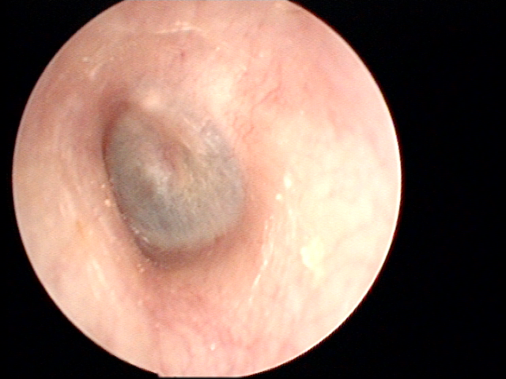

# ENT Medical Image Retrieval System

This project implements a deep learning-based medical image retrieval system for Ear, Nose, and Throat (ENT) images using vector field transformations and CLIP embeddings.

## Sample Results

### Query: Left Ear Image


**Top 5 Retrieved Images:**
1. Right Ear - Score: 0.8390
2. Right Ear - Score: 0.8252  
3. Left Ear - Score: 0.8226
4. Right Ear - Score: 0.7651
5. Left Ear - Score: 0.7628

The system successfully retrieves anatomically similar ear images with high confidence scores, demonstrating effective cross-lateral matching between left and right ear structures.

## Overview

The system uses a novel approach combining CLIP (Contrastive Language-Image Pre-training) embeddings with learned vector field transformations to improve medical image retrieval accuracy. The model achieves **95.4% Recall@1** on the test set.

## Dataset Classes

- **ear-left** / **ear-right**: Left and right ear images
- **nose-left** / **nose-right**: Left and right nostril images  
- **throat**: Throat/pharynx images
- **vc-open** / **vc-closed**: Open and closed vocal cord images

## Usage Instructions

### 1. Training
Open and run `train/train.ipynb` in Jupyter Notebook:
- Downloads training dataset automatically
- Generates CLIP embeddings for all images
- Trains vector field model with triplet loss
- Saves trained model as `vf_model.pth`

### 2. Inference  
Open and run `inference/predict.ipynb` in Jupyter Notebook:
- Downloads sample dataset and pretrained model
- Performs image retrieval for query images
- Displays top-k similar images with scores
- Generates visualization results

### 3. Evaluation
Run evaluation notebooks to assess model performance:
- `evaluation/clip-score.ipynb`: CLIP-based similarity metrics
- `evaluation/flow_matching_step10_step0_score.ipynb`: Vector field evaluation

## Project Structure

```
track_2/
├── train/train.ipynb           # Model training pipeline
├── inference/predict.ipynb     # Image retrieval inference  
├── evaluation/                 # Performance evaluation notebooks
├── model/vf_model.pth         # Trained model weights
└── sample/                    # Sample dataset by anatomical class
    ├── ear-left/
    ├── ear-right/ 
    ├── nose-left/
    ├── nose-right/
    ├── throat/
    ├── vc-open/
    └── vc-closed/
```